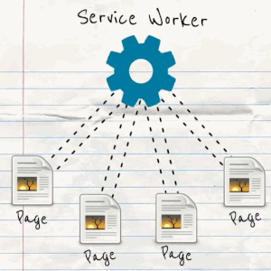

# What is Service Worker?

Service Worker is a new specification for browsers to solve issues with
offline and to give web apps functionality which has been possible only with
native apps.

The current implementations of Service Worker API(in Chrome Canary) are focused
to support offline features of the specification but it can
also be used for background syncing and push notifications in the future.

Like Web Worker, Service Worker runs in a different thread:

The difference is that instead of being controlled by the pages,
Service Worker controls the pages in the background.

At the time of writing, Service Worker can be only used in Chrome Canary.
**Browser support now**: https://jakearchibald.github.io/isserviceworkerready/

## Next steps

Further reading: http://jakearchibald.com/2014/service-worker-first-draft/

**Talks to watch**

* [Short introduction by Jake Archibald](https://www.youtube.com/watch?v=4uQMl7mFB6g) (15 min)

    Very good introduction to Service Worker: why is it needed, how to use it.

* [A bit longer talk by Jake Archibald](https://www.youtube.com/watch?v=_yy0CDLnhMA) (45 min)

    More detailed look to Service Worker.

* [Making Web Apps Appy by Alex Russell](https://www.youtube.com/watch?v=QbuLq4f6DGQ)

    Future of Service Worker. Implementing push notifications and other
    "native" app functionality to web apps.
